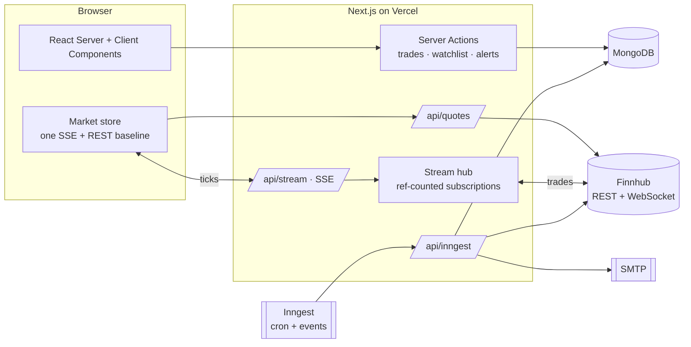

<div align="center">


### Real-time portfolio & market terminal

Live P&L streamed tick by tick, FIFO cost basis, sector allocation, risk metrics, price alerts and market news, all in one dark trading-desk UI.

[](https://github.com/sAchin-680/Real-Time-Stock-Market/actions/workflows/ci.yml)


**[Live demo →](https://real-time-stock-market-zeta.vercel.app)** &nbsp;·&nbsp; one click, no sign-up

</div>

---

## Highlights

- **Real-time by default.** Trades stream from Finnhub's WebSocket through a server-side hub to the browser over Server-Sent Events. Prices tick as they print, with flash-on-change, live sparklines and a "today's value" chart that draws itself.
- **Real portfolio accounting.** FIFO lot matching, fees capitalised into cost basis, realized vs. unrealized P&L, dividends, and a ledger that refuses inconsistent history (you can't sell shares you never bought).
- **Risk at a glance.** Value-weighted beta, Herfindahl concentration (HHI → "effective positions"), largest position and sector exposure.
- **Alerts that actually fire.** Price and daily-move alerts are evaluated every 5 minutes during market hours by a background job, de-duplicated per trading day, and emailed.
- **Built like a trading platform.** Ticker tape, ⌘K symbol search, keyboard navigation, market-session countdown, collapsible sidebar, and dense tabular numerics.
- **Instant demo.** Every visitor gets a private sandbox account with a seeded portfolio. It's purged after 24 hours.

## Features

| Area | What you get |
| --- | --- |
| **Dashboard** | Portfolio KPIs (value, today's P&L, unrealized, total return), live intraday value chart, top holdings, sector allocation, watchlist movers, closest alerts, personalized news, S&P 500 heatmap |
| **Portfolio** | Sortable live holdings with weights and sparklines · buy / sell / dividend entry · CSV import (validated atomically) and export · filterable transaction history · monthly realized P&L chart · risk panel |
| **Watchlist** | Live price, change, market cap, P/E, 52-week range position, inline alert creation, news for your symbols |
| **Alerts** | Price above/below and day-move up/down conditions, once or daily, pause/resume, edit, trigger history, "check now" |
| **Stock page** | Live quote header (O/H/L/prev close), your position, key statistics (beta, EPS, yield, margins, ROE), candlestick chart, technicals, financials |
| **Markets** | Index overview, sector heatmap, quotes and top stories |
| **Platform** | Market-hours engine (NYSE holidays and early closes), keyboard shortcuts, demo accounts, email notifications, health endpoint |

### Keyboard shortcuts

| Keys | Action |
| --- | --- |
| <kbd>⌘</kbd> <kbd>K</kbd> or <kbd>/</kbd> | Search symbols |
| <kbd>T</kbd> | New trade |
| <kbd>G</kbd> then <kbd>D</kbd> / <kbd>P</kbd> / <kbd>W</kbd> / <kbd>A</kbd> / <kbd>M</kbd> | Go to Dashboard / Portfolio / Watchlist / Alerts / Markets |
| <kbd>?</kbd> | Show all shortcuts |

## Architecture



### How real-time works

1. Components call `useLiveQuotes(symbols)`. A page-wide store merges every requested symbol into **one** `EventSource` and **one** REST poller.
2. `/api/stream` subscribes those symbols on a **single shared upstream WebSocket** per server instance. Subscriptions are reference counted, trade bursts are coalesced per symbol and flushed every 250 ms, and the upstream reconnects with exponential backoff.
3. Streamed prices are re-based on the previous close from the REST quote, so day change and P&L stay correct. If streaming is unavailable, the store falls back to polling (15 s when open, 2 min when closed) and the indicator switches from **Live** to **Delayed**.
4. Client-side re-marking (`lib/finance/live.ts`) is tested for parity with the server engine, so live numbers always match a page refresh.

### Portfolio engine

`lib/finance/portfolio.ts` is pure and I/O-free. It replays transactions chronologically into FIFO lots (buys before sells on the same day), produces realized events, marks open positions to market, and derives allocation and risk. Every number on screen is reproducible and covered by unit tests.

### Background jobs (Inngest)

| Function | Trigger | What it does |
| --- | --- | --- |
| `check-price-alerts` | every 5 min, weekdays 9–16 ET | Evaluates active alerts only while the market is open; each trigger is a conditional update, so overlapping runs never double-fire |
| `daily-news-summary` | daily 12:00 UTC | Per-user digest from watchlist news, summarized and emailed |
| `sign-up-email` | `app/user.created` | Personalized welcome email |
| `purge-demo-accounts` | hourly | Deletes demo users and their data after 24 h |

## Tech stack

**Frontend:** Next.js 15 (App Router, RSC, Server Actions) · React 19 · TypeScript (strict) · Tailwind CSS 4 · Radix UI / shadcn · lucide icons · TradingView widgets
**Backend:** Next.js route handlers and server actions · MongoDB + Mongoose · Better Auth (email/password, sessions) · Zod validation · Inngest · Nodemailer · Gemini
**Market data:** Finnhub REST (quotes, profiles, fundamentals, news) and WebSocket (trades)
**Quality and delivery:** Vitest with coverage gates · ESLint (zero warnings) · GitHub Actions (lint, typecheck, test, build, Docker) · Dependabot · Docker multi-stage image · Vercel

## Getting started

### Prerequisites

- Node.js **22**
- MongoDB: local, Docker, or a free [Atlas](https://www.mongodb.com/atlas) cluster
- A free [Finnhub](https://finnhub.io) API key

### Run locally

```bash
git clone https://github.com/sAchin-680/Real-Time-Stock-Market.git
cd Real-Time-Stock-Market
npm install
cp .env.example .env.local   # then fill in the values below
npm run dev                  # http://localhost:3000
```

Without `MONGODB_URI`, development falls back to `mongodb://127.0.0.1:27017/signalist`. Without a Finnhub key, the app still runs: positions are valued at cost and a notice explains how to enable live data.

To run the background jobs locally, start the Inngest dev server in a second terminal:

```bash
npx inngest-cli@latest dev -u http://localhost:3000/api/inngest
```

### Run with Docker

```bash
cp .env.example .env         # set FINNHUB_API_KEY and BETTER_AUTH_SECRET
docker compose up --build    # app :3000 · MongoDB · Inngest dev server :8288
```

### Environment variables

| Variable | Required | Description |
| --- | --- | --- |
| `MONGODB_URI` | ✅ | MongoDB connection string |
| `BETTER_AUTH_SECRET` | ✅ | 32+ random characters (`openssl rand -base64 32`) |
| `BETTER_AUTH_URL` | ✅ | Public URL of the app, e.g. `https://your-app.vercel.app` |
| `FINNHUB_API_KEY` | ✅ for live data | Quotes, fundamentals, news and the trade stream (server-side only) |
| `INNGEST_EVENT_KEY` / `INNGEST_SIGNING_KEY` | production jobs | Added automatically by the Inngest Vercel integration |
| `NODEMAILER_EMAIL` / `NODEMAILER_PASSWORD` | for emails | Gmail address and [app password](https://support.google.com/accounts/answer/185833) |
| `GEMINI_API_KEY` | optional | Personalized welcome emails and daily digests |
| `EMAIL_FROM_NAME` | optional | Sender name (default `Signalist`) |
| `LOG_LEVEL` | optional | `debug` · `info` · `warn` · `error` |

## Scripts

| Command | Description |
| --- | --- |
| `npm run dev` | Dev server (Turbopack) |
| `npm run build` / `npm start` | Production build / server |
| `npm run lint` | ESLint with zero warnings allowed |
| `npm run typecheck` | `tsc --noEmit` |
| `npm test` / `npm run test:coverage` | Unit tests / with coverage thresholds |
| `npm run check` | Lint + typecheck + tests |

## API

| Endpoint | Auth | Description |
| --- | --- | --- |
| `GET /api/health` | public | DB ping, market-data config, market session, version; `503` when degraded |
| `GET /api/quotes?symbols=AAPL,MSFT` | session | Batched quotes (max 50), rate limited, plus market status |
| `GET /api/stream?symbols=AAPL,BINANCE:BTCUSDT` | session | Server-Sent Events: `ticks` events with `{s, p, t, v}` |
| `GET /api/portfolio/export` | session | Transactions as CSV |
| `/api/inngest` | signed | Inngest function endpoint |

**CSV import format** (header row required, any column order):

```csv
date,symbol,side,quantity,price,fees,notes
2026-01-15,AAPL,BUY,10,185.50,1,Core position
2026-06-20,AAPL,SELL,4,214.30,1,Trim
2026-08-14,AAPL,DIVIDEND,6,0.26,0,Q3 dividend
```

## Security

- The market-data key is server-only. Browsers receive quotes and ticks through authenticated endpoints, never the key.
- Every server action re-validates input with Zod and scopes queries to the session user. Helpers that must not be callable from the browser live in `server-only` modules.
- Rate limiting covers auth, search, quotes, the stream and on-demand alert checks.
- CSP (scoped to TradingView), HSTS, `X-Frame-Options: DENY`, strict referrer and permissions policies; no `X-Powered-By`.
- Email templates escape user-controlled values; CSV export neutralizes spreadsheet formula injection.
- The Docker image runs as a non-root user with a healthcheck.

## Project structure

```text
app/
  (auth)/              sign-in, sign-up (with one-click demo)
  (root)/              dashboard, portfolio, watchlist, alerts, markets, stocks/[symbol]
  api/                 health, quotes, stream (SSE), portfolio/export, inngest
components/
  finance/             holdings, charts, dialogs, alerts board, sparklines
  layout/              sidebar, ticker tape, status bar, live indicator, shortcuts
  ui/                  Radix/shadcn primitives
lib/
  finance/             pure engines: portfolio (FIFO, P&L, risk), alerts, live re-marking
  server/              Finnhub client, stream hub, session helpers (server-only)
  client/              shared real-time market store
  services/            portfolio, alerts, news, users, demo (server-only)
  actions/             server actions
  inngest/             background functions and prompts
database/models/       transactions, alerts, watchlist
tests/                 unit tests
```

## Deployment

The project deploys to **Vercel** through its GitHub integration: pull requests get preview deployments and merges to `main` go to production. Set the environment variables above in *Project → Settings → Environment Variables* (mark secrets as **Sensitive**), install the **Inngest** integration for scheduled jobs, and allow Vercel to reach MongoDB (Atlas network access `0.0.0.0/0`).

Any container platform works too: `docker build -t signalist .` produces a standalone, non-root image that serves on port 3000.

---

<sub>Market data © Finnhub and TradingView. For informational purposes only; not investment advice.</sub>
