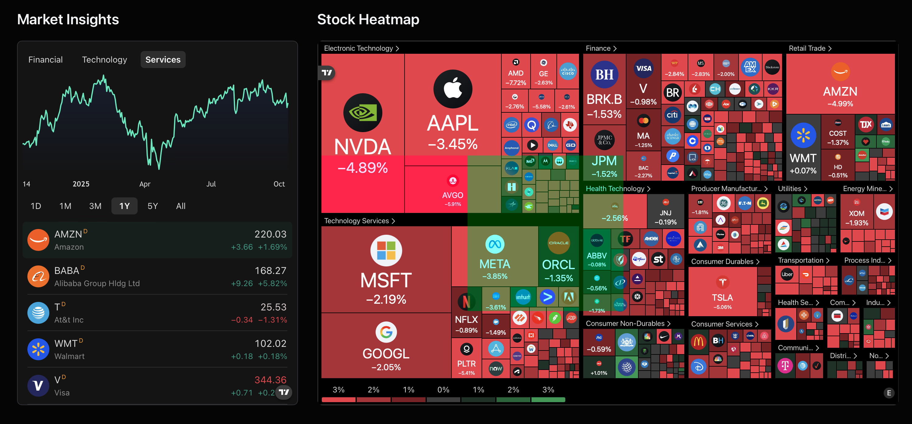
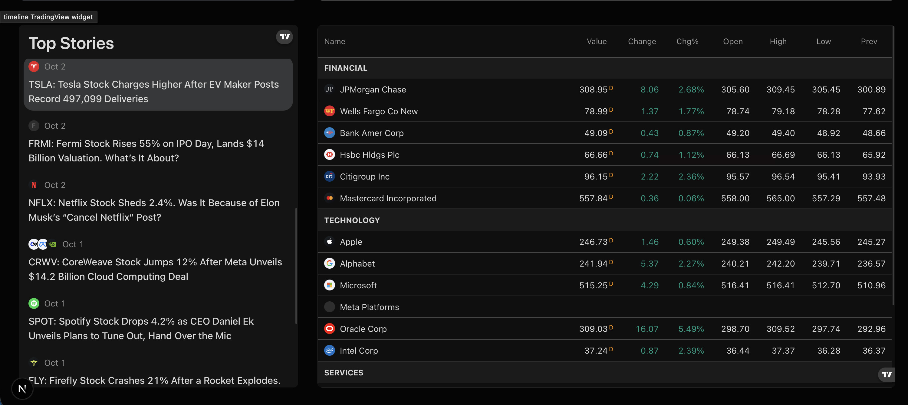

 
 
 # Real Time Stock Market App

## Introduction

Welcome to the Real Time Stock Market App! This modern, real-time platform is designed to help users seamlessly track stock prices, set personalized alerts, explore company insights, and manage watchlists. Built with cutting-edge technologies like **Next.js**, **Shadcn**, **Better Auth**, and **Inngest**, this application provides a robust foundation for developers looking to create dynamic financial platforms.

The app features an intuitive admin dashboard that enables efficient stock management, news publication, and user activity monitoring. Event-driven workflows power automated features, such as Real Time - generated daily digests, earnings notifications, real-time alerts, and sentiment analysis, ensuring an engaging and insightful user experience.

---

## Table of Contents

- [Features](#features)
- [Installation](#installation)
- [Usage](#usage)
- [Technology Stack](#technology-stack)
- [System Architecture](#system-architecture)
- [Contributing](#contributing)
- [License](#license)

---

## Features

- **Real-Time Stock Tracking**: View up-to-date stock prices, charts, and other market data.
- **Personalized Alerts**: Set price thresholds and receive alerts via notifications.
- **Company Insights**: Access in-depth analytics on company performance, earnings, and trends.
- **Watchlist Management**: Keep track of favorite stocks and easily monitor them.
- **Admin Dashboard**: Manage stock data, publish news updates, and monitor user activity.
- **Event-Driven Automation**: Leverage Real Time - generated daily digests, sentiment analysis, and more.
- **Real-Time Notifications**: Get notified instantly on stock price changes, earnings reports, and news updates.

---

## Installation

To get started with the Real Time Stock Market App, follow these steps:

## Prerequisites

- **Node.js** (v14 or higher)
- **Yarn** (or npm)
- **Database** (e.g., MongoDB, PostgreSQL, etc.)

## Step 1: Clone the Repository

```
git clone https://github.com/yourusername/Real_time-stock-market-app.git
cd Real_time-stock-market-app
```
## Step 2: Install Dependencies

Using Yarn:
```
yarn install
```
Or using npm:
```
npm install
```
## Step 3: Configure Environment Variables
Create a `.env` file in the root directory and add the following configuration:
```
NEXT_PUBLIC_API_KEY=<your_api_key>
DATABASE_URL=<your_database_url>
SECRET_KEY=<your_secret_key>
```
Make sure to replace `<your_api_key>` and other values with your actual credentials.

## Step 4: Run the Development Server
For development:
```
yarn dev
```
Or if using npm:
```
npm run dev
```
Visit http://localhost:3000 to see the app in action.


---
## Usage

- Track Real-Time Stock Prices: Upon logging in, you'll see a dashboard with live stock prices and charts.

- Set Alerts: Easily configure alerts for specific stocks, price changes, and news updates.

- Explore Company Insights: Dive into detailed analytics, financials, and recent performance trends.
- Admin Dashboard: Manage stock data, publish market news, and view user interactions and activities.


## Technology Stack
- Frontend:
    - Next.js
    - Shadcn UI

- Authentication:
    - Better Auth
- Backend & Event-Driven Workflows:
    - Inngest
- Database:
    - (PostgreSQL/MongoDB, etc.)
- APIs:
    - Stock Market API: For fetching real-time stock data (e.g., Alpha Vantage, Yahoo Finance, etc.)
- Real Time Features:
    - Real Time Daily Digest Generation

---

## System Architecture

### High-Level Architecture


## Event-Driven Workflows
- Stock Alert: When a stock price hits a specified threshold, an event triggers a notification to the user.

- Real Time Digest: Each day, the system triggers an event to generate and send a personalized Real Time stock digest.

- Earnings Notification: Real-time alerts for earnings reports based on company performance.


--- 


### Contributing
- To get started:

1. Fork the repository.

2. Create a new branch (`git checkout -b feature-xyz`).

3. Make your changes and commit them (`git commit -am 'Add new feature'`).
4. Push to your fork (`git push origin feature-xyz`).
5. Create a new pull request.

Please ensure your code adheres to the coding standards and is properly tested before submitting a pull request.

---


## License

This project is licensed under the MIT License - see the [LICENSE](LICENSE) file for details.

--- 


## Acknowledgments

We would like to extend our gratitude to the following tools, libraries, and services that made this project possible:

- **[Next.js](https://nextjs.org/)**: For providing a powerful and flexible React framework that helps create fast, scalable, and dynamic web applications.
  
- **[Shadcn UI](https://shadcn.dev/)**: For offering beautifully designed UI components that allow for easy customization and implementation, making the app visually appealing and user-friendly.

- **[Inngest](https://www.inngest.com/)**: For enabling event-driven serverless workflows that streamline and automate various processes, including stock price alerts and daily Real Time-generated digests.

- **[Better Auth](https://betterauth.com/)**: For delivering secure, seamless authentication solutions that simplify user management and improve the overall security of the application.

We highly recommend these tools for anyone building modern, dynamic web applications!

